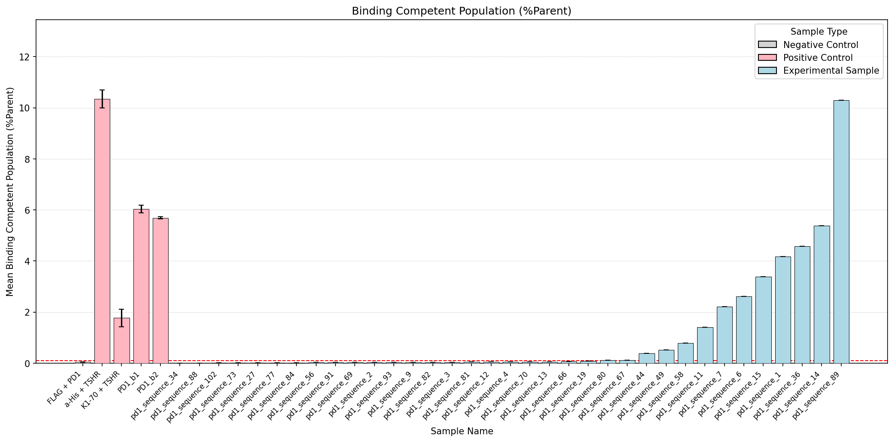
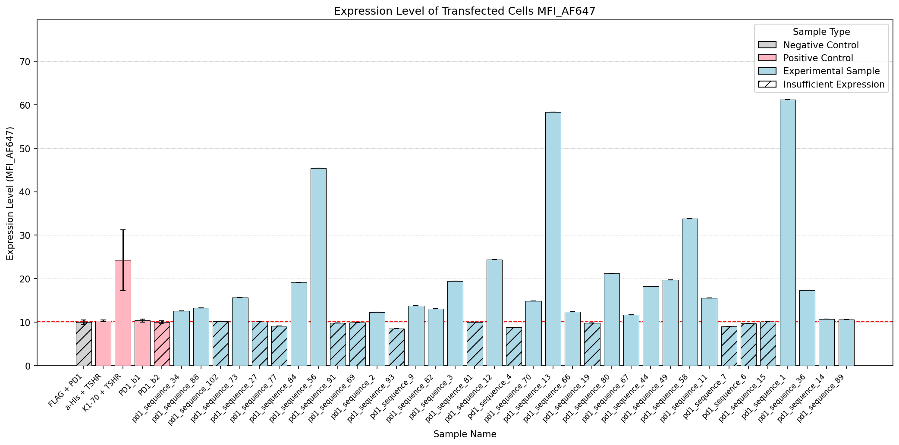
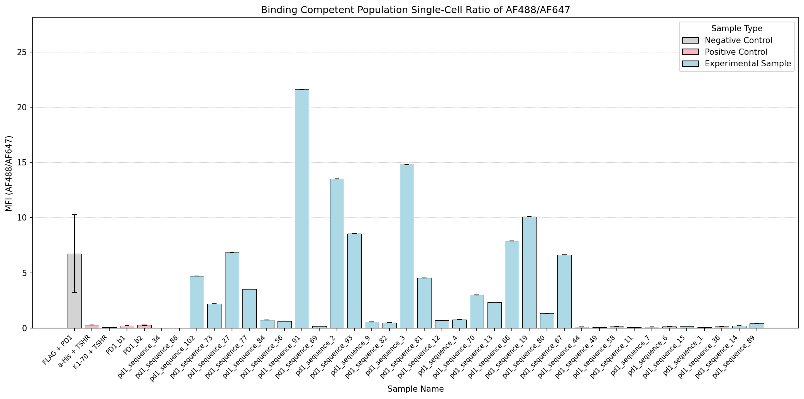
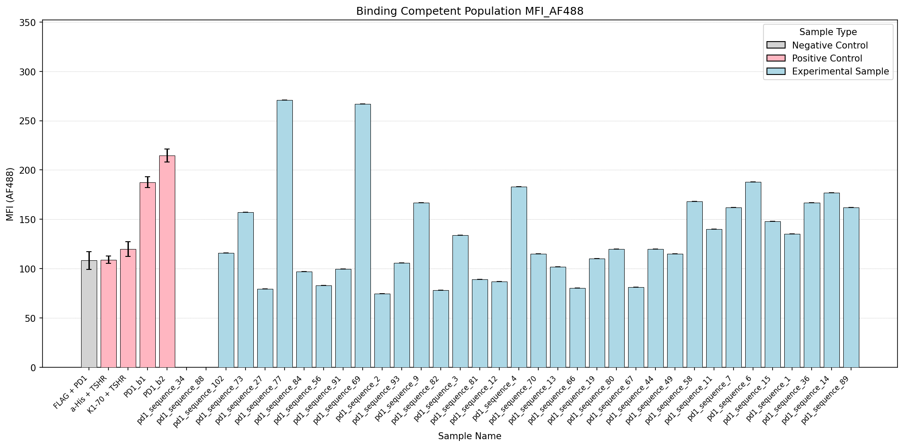

# Flow Cytometry Analysis Summary

## Key Findings

- Experimental samples >2X mock expression: 23 (pd1_sequence_1, pd1_sequence_2, pd1_sequence_3, pd1_sequence_9, pd1_sequence_11, pd1_sequence_12, pd1_sequence_13, pd1_sequence_14, pd1_sequence_34, pd1_sequence_36, pd1_sequence_44, pd1_sequence_49, pd1_sequence_56, pd1_sequence_58, pd1_sequence_66, pd1_sequence_67, pd1_sequence_70, pd1_sequence_73, pd1_sequence_80, pd1_sequence_82, pd1_sequence_84, pd1_sequence_88, pd1_sequence_89)
- From that subset, samples >2X FLAG binding %Parent threshold: 10 (pd1_sequence_1, pd1_sequence_11, pd1_sequence_14, pd1_sequence_36, pd1_sequence_44, pd1_sequence_49, pd1_sequence_58, pd1_sequence_67, pd1_sequence_80, pd1_sequence_89)
- From that subset, samples above mean AF488/AF647 ratio of all controls (3.98): 1 (pd1_sequence_67)

## Data Table

| Sample Name        | Sample Type         | >2X Mock Expression   | Expression Level (MFI_AF647)   | Singlets/AF647(+)/AF488(+) %Parent   | MFI Ratio (AF488/AF647)   | MFI AF488     |
|:-------------------|:--------------------|:----------------------|:-------------------------------|:-------------------------------------|:--------------------------|:--------------|
| Mock               | Negative Control    | No                    | 6.75 ± 1.95                    | 2.08 ± 2.08                          | 13.40 ± nan               | 77.80 ± nan   |
| a-His + TSHR       | Positive Control    | Yes                   | 10.33 ± 0.19                   | 10.35 ± 0.35                         | 0.27 ± 0.01               | 109.00 ± 3.79 |
| K1-70 + TSHR       | Positive Control    | Yes                   | 24.27 ± 6.99                   | 1.77 ± 0.34                          | 0.06 ± 0.01               | 120.00 ± 7.51 |
| PD1_b1             | Positive Control    | Yes                   | 10.38 ± 0.36                   | 6.04 ± 0.14                          | 0.22 ± 0.02               | 187.67 ± 5.61 |
| PD1_b2             | Positive Control    | No                    | 9.97 ± 0.37                    | 5.69 ± 0.05                          | 0.26 ± 0.02               | 214.67 ± 6.64 |
| FLAG + PD1         | Negative Control    | No                    | 9.99 ± 0.52                    | 0.05 ± 0.01                          | 6.73 ± 3.54               | 108.33 ± 8.95 |
| pd1_sequence_1     | Experimental Sample | Yes                   | 61.20 ± 0.00                   | 4.18 ± 0.00                          | 0.05 ± 0.00               | 135.00 ± 0.00 |
| pd1_sequence_2     | Experimental Sample | Yes                   | 12.30 ± 0.00                   | 0.03 ± 0.00                          | 13.50 ± 0.00              | 74.70 ± 0.00  |
| pd1_sequence_3     | Experimental Sample | Yes                   | 19.40 ± 0.00                   | 0.04 ± 0.00                          | 14.80 ± 0.00              | 134.00 ± 0.00 |
| pd1_sequence_4     | Experimental Sample | No                    | 8.86 ± 0.00                    | 0.05 ± 0.00                          | 0.78 ± 0.00               | 183.00 ± 0.00 |
| pd1_sequence_6     | Experimental Sample | No                    | 9.66 ± 0.00                    | 2.61 ± 0.00                          | 0.12 ± 0.00               | 188.00 ± 0.00 |
| pd1_sequence_7     | Experimental Sample | No                    | 9.05 ± 0.00                    | 2.21 ± 0.00                          | 0.11 ± 0.00               | 162.00 ± 0.00 |
| pd1_sequence_9     | Experimental Sample | Yes                   | 13.80 ± 0.00                   | 0.04 ± 0.00                          | 0.55 ± 0.00               | 167.00 ± 0.00 |
| pd1_sequence_11    | Experimental Sample | Yes                   | 15.60 ± 0.00                   | 1.40 ± 0.00                          | 0.06 ± 0.00               | 140.00 ± 0.00 |
| pd1_sequence_12    | Experimental Sample | Yes                   | 24.40 ± 0.00                   | 0.04 ± 0.00                          | 0.70 ± 0.00               | 87.10 ± 0.00  |
| pd1_sequence_13    | Experimental Sample | Yes                   | 58.30 ± 0.00                   | 0.06 ± 0.00                          | 2.33 ± 0.00               | 102.00 ± 0.00 |
| pd1_sequence_14    | Experimental Sample | Yes                   | 10.70 ± 0.00                   | 5.38 ± 0.00                          | 0.22 ± 0.00               | 177.00 ± 0.00 |
| pd1_sequence_15    | Experimental Sample | No                    | 10.10 ± 0.00                   | 3.38 ± 0.00                          | 0.16 ± 0.00               | 148.00 ± 0.00 |
| pd1_sequence_19    | Experimental Sample | No                    | 9.76 ± 0.00                    | 0.07 ± 0.00                          | 10.10 ± 0.00              | 110.00 ± 0.00 |
| pd1_sequence_27    | Experimental Sample | No                    | 10.10 ± 0.00                   | 0.02 ± 0.00                          | 6.82 ± 0.00               | 79.40 ± 0.00  |
| pd1_sequence_34    | Experimental Sample | Yes                   | 12.60 ± 0.00                   | 0.00 ± 0.00                          | nan ± 0.00                | nan ± 0.00    |
| pd1_sequence_36    | Experimental Sample | Yes                   | 17.30 ± 0.00                   | 4.58 ± 0.00                          | 0.13 ± 0.00               | 167.00 ± 0.00 |
| pd1_sequence_44    | Experimental Sample | Yes                   | 18.20 ± 0.00                   | 0.38 ± 0.00                          | 0.09 ± 0.00               | 120.00 ± 0.00 |
| pd1_sequence_49    | Experimental Sample | Yes                   | 19.70 ± 0.00                   | 0.52 ± 0.00                          | 0.06 ± 0.00               | 115.00 ± 0.00 |
| pd1_sequence_56    | Experimental Sample | Yes                   | 45.40 ± 0.00                   | 0.02 ± 0.00                          | 0.63 ± 0.00               | 82.80 ± 0.00  |
| pd1_sequence_58    | Experimental Sample | Yes                   | 33.80 ± 0.00                   | 0.79 ± 0.00                          | 0.14 ± 0.00               | 168.00 ± 0.00 |
| pd1_sequence_66    | Experimental Sample | Yes                   | 12.40 ± 0.00                   | 0.06 ± 0.00                          | 7.88 ± 0.00               | 80.50 ± 0.00  |
| pd1_sequence_67    | Experimental Sample | Yes                   | 11.70 ± 0.00                   | 0.12 ± 0.00                          | 6.63 ± 0.00               | 81.30 ± 0.00  |
| pd1_sequence_69    | Experimental Sample | No                    | 9.87 ± 0.00                    | 0.03 ± 0.00                          | 0.17 ± 0.00               | 267.00 ± 0.00 |
| pd1_sequence_70    | Experimental Sample | Yes                   | 14.90 ± 0.00                   | 0.05 ± 0.00                          | 2.99 ± 0.00               | 115.00 ± 0.00 |
| pd1_sequence_73    | Experimental Sample | Yes                   | 15.70 ± 0.00                   | 0.02 ± 0.00                          | 2.21 ± 0.00               | 157.00 ± 0.00 |
| pd1_sequence_77    | Experimental Sample | No                    | 9.15 ± 0.00                    | 0.02 ± 0.00                          | 3.51 ± 0.00               | 271.00 ± 0.00 |
| pd1_sequence_80    | Experimental Sample | Yes                   | 21.20 ± 0.00                   | 0.11 ± 0.00                          | 1.32 ± 0.00               | 120.00 ± 0.00 |
| pd1_sequence_81    | Experimental Sample | No                    | 9.98 ± 0.00                    | 0.04 ± 0.00                          | 4.55 ± 0.00               | 89.30 ± 0.00  |
| pd1_sequence_82    | Experimental Sample | Yes                   | 13.10 ± 0.00                   | 0.04 ± 0.00                          | 0.50 ± 0.00               | 78.20 ± 0.00  |
| pd1_sequence_84    | Experimental Sample | Yes                   | 19.10 ± 0.00                   | 0.02 ± 0.00                          | 0.73 ± 0.00               | 96.90 ± 0.00  |
| pd1_sequence_88    | Experimental Sample | Yes                   | 13.30 ± 0.00                   | 0.00 ± 0.00                          | nan ± 0.00                | nan ± 0.00    |
| pd1_sequence_89    | Experimental Sample | Yes                   | 10.60 ± 0.00                   | 10.30 ± 0.00                         | 0.40 ± 0.00               | 162.00 ± 0.00 |
| pd1_sequence_91    | Experimental Sample | No                    | 9.78 ± 0.00                    | 0.03 ± 0.00                          | 21.60 ± 0.00              | 99.60 ± 0.00  |
| pd1_sequence_93    | Experimental Sample | No                    | 8.54 ± 0.00                    | 0.03 ± 0.00                          | 8.55 ± 0.00               | 106.00 ± 0.00 |
| pd1_sequence_102   | Experimental Sample | No                    | 10.20 ± 0.00                   | 0.01 ± 0.00                          | 4.69 ± 0.00               | 116.00 ± 0.00 |
| Mock + His(AF488)  | Negative Control    | No                    | 5.96 ± 3.45                    | 0.28 ± 0.28                          | 6.93 ± nan                | 62.80 ± nan   |
| Mock + FLAG(AF647) | Negative Control    | No                    | 3.42 ± 0.00                    | 0.00 ± 0.00                          | nan ± 0.00                | nan ± 0.00    |
| Mock + Fc(AF488)   | Negative Control    | No                    | 2.64 ± 0.33                    | 0.00 ± 0.00                          | nan ± nan                 | nan ± nan     |

## Figures

### Binding Competent Population (%Parent)

### Expression Level of Transfected Cells MFI_AF647

### Binding Competent Population Single-Cell Ratio of AF488/AF647

### Binding Competent Population MFI_AF488

