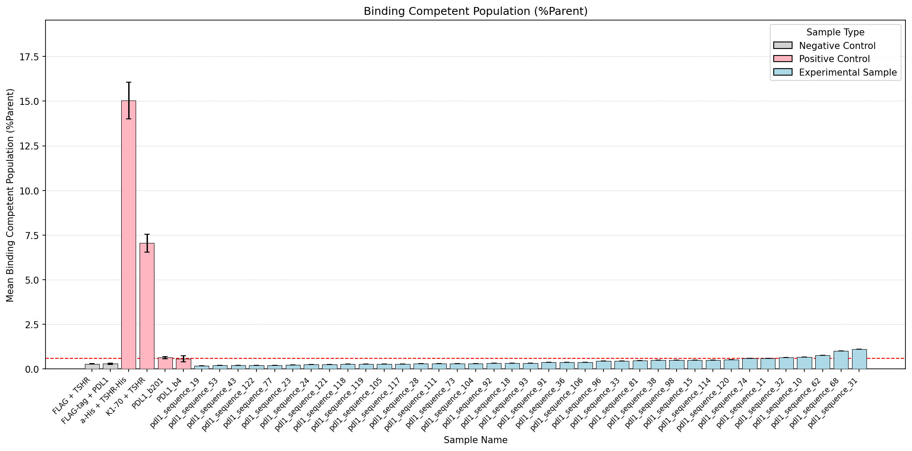
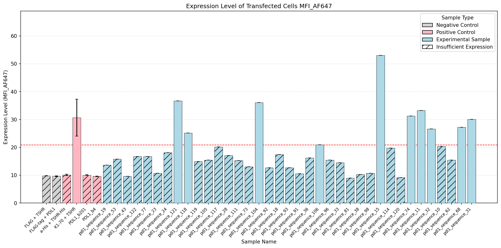
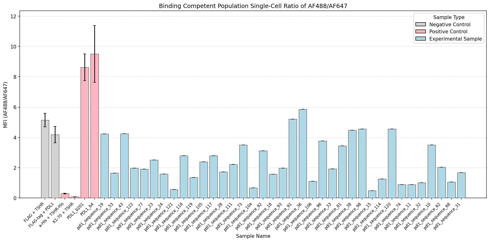
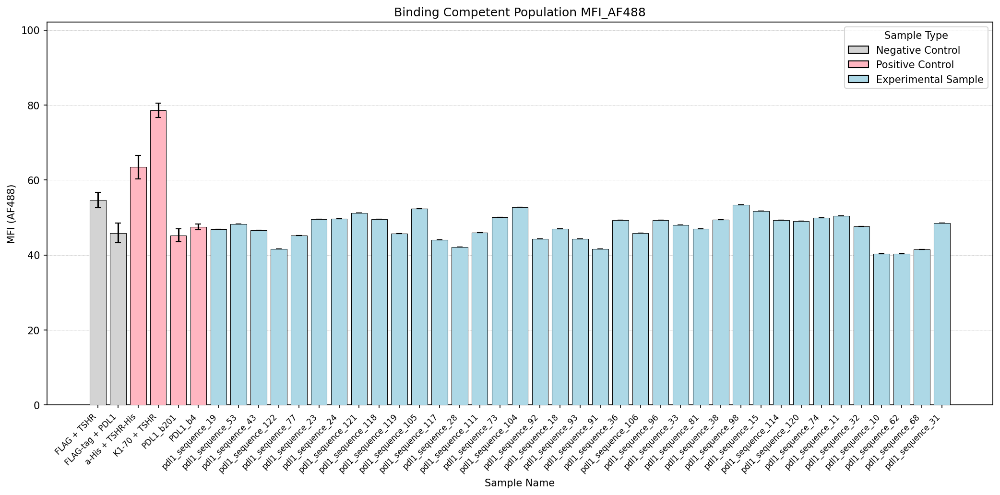

# Flow Cytometry Analysis Summary

## Key Findings

- Experimental samples >2X mock expression: 10 (pdl1_sequence_31, pdl1_sequence_68, pdl1_sequence_118, pdl1_sequence_11, pdl1_sequence_32, pdl1_sequence_15, pdl1_sequence_74, pdl1_sequence_104, pdl1_sequence_121, pdl1_sequence_106)
- From that subset, samples >2X FLAG binding %Parent threshold: 4 (pdl1_sequence_31, pdl1_sequence_68, pdl1_sequence_11, pdl1_sequence_32)
- From that subset, samples above mean AF488/AF647 ratio of all controls (10.10): 0 (None)

## Data Table

| Sample Name        | Sample Type         | >2X Mock Expression   | Expression Level (MFI_AF647)   | Singlets/AF647(+)/AF488(+) %Parent   | MFI Ratio (AF488/AF647)   | MFI AF488    |
|:-------------------|:--------------------|:----------------------|:-------------------------------|:-------------------------------------|:--------------------------|:-------------|
| Mock Unlabeled     | Negative Control    | No                    | 5.55 ± 1.47                    | 3.70 ± 3.70                          | 54.30 ± nan               | 118.00 ± nan |
| pdl1_sequence_10   | Experimental Sample | No                    | 20.30 ± 0.00                   | 0.67 ± 0.00                          | 3.50 ± 0.00               | 40.30 ± 0.00 |
| pdl1_sequence_31   | Experimental Sample | Yes                   | 30.10 ± 0.00                   | 1.12 ± 0.00                          | 1.68 ± 0.00               | 48.50 ± 0.00 |
| pdl1_sequence_68   | Experimental Sample | Yes                   | 27.20 ± 0.00                   | 1.01 ± 0.00                          | 1.06 ± 0.00               | 41.50 ± 0.00 |
| pdl1_sequence_96   | Experimental Sample | No                    | 15.40 ± 0.00                   | 0.45 ± 0.00                          | 3.77 ± 0.00               | 49.30 ± 0.00 |
| pdl1_sequence_118  | Experimental Sample | Yes                   | 25.20 ± 0.00                   | 0.27 ± 0.00                          | 2.79 ± 0.00               | 49.60 ± 0.00 |
| a-His + TSHR-His   | Positive Control    | No                    | 10.12 ± 0.24                   | 15.03 ± 1.02                         | 0.30 ± 0.02               | 63.43 ± 3.14 |
| pdl1_sequence_11   | Experimental Sample | Yes                   | 33.20 ± 0.00                   | 0.60 ± 0.00                          | 0.89 ± 0.00               | 50.50 ± 0.00 |
| pdl1_sequence_32   | Experimental Sample | Yes                   | 26.60 ± 0.00                   | 0.66 ± 0.00                          | 1.01 ± 0.00               | 47.60 ± 0.00 |
| pdl1_sequence_73   | Experimental Sample | No                    | 13.00 ± 0.00                   | 0.30 ± 0.00                          | 3.50 ± 0.00               | 50.10 ± 0.00 |
| pdl1_sequence_98   | Experimental Sample | No                    | 10.70 ± 0.00                   | 0.49 ± 0.00                          | 4.55 ± 0.00               | 53.40 ± 0.00 |
| pdl1_sequence_119  | Experimental Sample | No                    | 14.90 ± 0.00                   | 0.27 ± 0.00                          | 1.35 ± 0.00               | 45.70 ± 0.00 |
| K1-70 + TSHR       | Positive Control    | Yes                   | 30.67 ± 6.64                   | 7.06 ± 0.50                          | 0.08 ± 0.01               | 78.57 ± 1.94 |
| pdl1_sequence_15   | Experimental Sample | Yes                   | 53.00 ± 0.00                   | 0.49 ± 0.00                          | 0.48 ± 0.00               | 51.70 ± 0.00 |
| pdl1_sequence_33   | Experimental Sample | No                    | 14.50 ± 0.00                   | 0.45 ± 0.00                          | 1.93 ± 0.00               | 48.00 ± 0.00 |
| pdl1_sequence_74   | Experimental Sample | Yes                   | 31.30 ± 0.00                   | 0.59 ± 0.00                          | 0.89 ± 0.00               | 50.00 ± 0.00 |
| pdl1_sequence_104  | Experimental Sample | Yes                   | 36.10 ± 0.00                   | 0.31 ± 0.00                          | 0.68 ± 0.00               | 52.80 ± 0.00 |
| pdl1_sequence_120  | Experimental Sample | No                    | 9.17 ± 0.00                    | 0.52 ± 0.00                          | 4.55 ± 0.00               | 49.00 ± 0.00 |
| PDL1_b4            | Positive Control    | No                    | 9.59 ± 0.09                    | 0.57 ± 0.18                          | 9.51 ± 1.87               | 47.47 ± 0.77 |
| pdl1_sequence_18   | Experimental Sample | No                    | 17.40 ± 0.00                   | 0.34 ± 0.00                          | 1.57 ± 0.00               | 47.00 ± 0.00 |
| pdl1_sequence_36   | Experimental Sample | No                    | 16.20 ± 0.00                   | 0.38 ± 0.00                          | 5.85 ± 0.00               | 49.30 ± 0.00 |
| pdl1_sequence_77   | Experimental Sample | No                    | 16.70 ± 0.00                   | 0.22 ± 0.00                          | 1.91 ± 0.00               | 45.20 ± 0.00 |
| pdl1_sequence_105  | Experimental Sample | No                    | 15.40 ± 0.00                   | 0.28 ± 0.00                          | 2.39 ± 0.00               | 52.40 ± 0.00 |
| pdl1_sequence_121  | Experimental Sample | Yes                   | 36.70 ± 0.00                   | 0.26 ± 0.00                          | 0.57 ± 0.00               | 51.20 ± 0.00 |
| PDL1_b201          | Positive Control    | No                    | 10.06 ± 0.10                   | 0.64 ± 0.07                          | 8.63 ± 0.89               | 45.27 ± 1.76 |
| pdl1_sequence_19   | Experimental Sample | No                    | 13.60 ± 0.00                   | 0.19 ± 0.00                          | 4.23 ± 0.00               | 46.90 ± 0.00 |
| pdl1_sequence_38   | Experimental Sample | No                    | 10.30 ± 0.00                   | 0.49 ± 0.00                          | 4.48 ± 0.00               | 49.40 ± 0.00 |
| pdl1_sequence_81   | Experimental Sample | No                    | 9.02 ± 0.00                    | 0.47 ± 0.00                          | 3.44 ± 0.00               | 47.00 ± 0.00 |
| pdl1_sequence_106  | Experimental Sample | Yes                   | 20.90 ± 0.00                   | 0.39 ± 0.00                          | 1.10 ± 0.00               | 45.90 ± 0.00 |
| pdl1_sequence_122  | Experimental Sample | No                    | 16.70 ± 0.00                   | 0.20 ± 0.00                          | 1.98 ± 0.00               | 41.60 ± 0.00 |
| FLAG + TSHR        | Negative Control    | No                    | 9.80 ± 0.04                    | 0.29 ± 0.01                          | 5.14 ± 0.45               | 54.67 ± 2.08 |
| pdl1_sequence_23   | Experimental Sample | No                    | 10.70 ± 0.00                   | 0.23 ± 0.00                          | 2.52 ± 0.00               | 49.60 ± 0.00 |
| pdl1_sequence_43   | Experimental Sample | No                    | 9.58 ± 0.00                    | 0.20 ± 0.00                          | 4.25 ± 0.00               | 46.60 ± 0.00 |
| pdl1_sequence_91   | Experimental Sample | No                    | 10.50 ± 0.00                   | 0.37 ± 0.00                          | 5.21 ± 0.00               | 41.60 ± 0.00 |
| pdl1_sequence_111  | Experimental Sample | No                    | 15.30 ± 0.00                   | 0.30 ± 0.00                          | 2.22 ± 0.00               | 46.00 ± 0.00 |
| Mock + FLAG(AF647) | Negative Control    | No                    | 10.65 ± 0.35                   | 0.78 ± 0.78                          | 4.75 ± nan                | 34.10 ± nan  |
| FLAG-tag + PDL1    | Negative Control    | No                    | 9.65 ± 0.13                    | 0.30 ± 0.03                          | 4.19 ± 0.54               | 45.87 ± 2.60 |
| pdl1_sequence_24   | Experimental Sample | No                    | 18.10 ± 0.00                   | 0.26 ± 0.00                          | 1.59 ± 0.00               | 49.70 ± 0.00 |
| pdl1_sequence_53   | Experimental Sample | No                    | 15.80 ± 0.00                   | 0.20 ± 0.00                          | 1.65 ± 0.00               | 48.30 ± 0.00 |
| pdl1_sequence_92   | Experimental Sample | No                    | 12.70 ± 0.00                   | 0.33 ± 0.00                          | 3.12 ± 0.00               | 44.30 ± 0.00 |
| pdl1_sequence_114  | Experimental Sample | No                    | 19.70 ± 0.00                   | 0.51 ± 0.00                          | 1.26 ± 0.00               | 49.30 ± 0.00 |
| Mock + His(AF488)  | Negative Control    | No                    | 10.20 ± 0.80                   | 11.78 ± 7.22                         | 3.97 ± 3.93               | 46.35 ± 2.15 |
| pdl1_sequence_28   | Experimental Sample | No                    | 17.10 ± 0.00                   | 0.30 ± 0.00                          | 1.72 ± 0.00               | 42.10 ± 0.00 |
| pdl1_sequence_62   | Experimental Sample | No                    | 15.40 ± 0.00                   | 0.77 ± 0.00                          | 2.04 ± 0.00               | 40.40 ± 0.00 |
| pdl1_sequence_93   | Experimental Sample | No                    | 12.70 ± 0.00                   | 0.34 ± 0.00                          | 1.97 ± 0.00               | 44.30 ± 0.00 |
| pdl1_sequence_117  | Experimental Sample | No                    | 20.20 ± 0.00                   | 0.28 ± 0.00                          | 2.80 ± 0.00               | 44.00 ± 0.00 |

## Figures

### Binding Competent Population (%Parent)

### Expression Level of Transfected Cells MFI_AF647

### Binding Competent Population Single-Cell Ratio of AF488/AF647

### Binding Competent Population MFI_AF488

