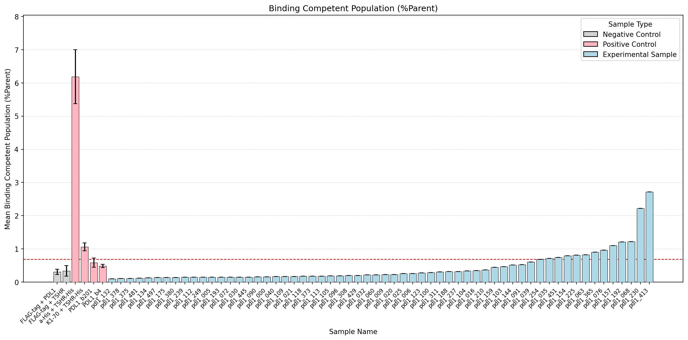
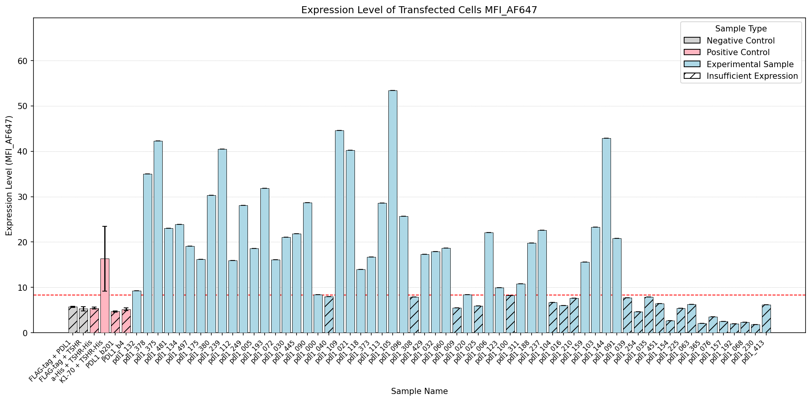
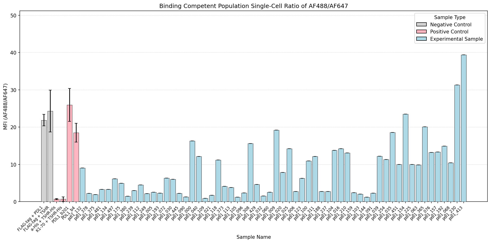
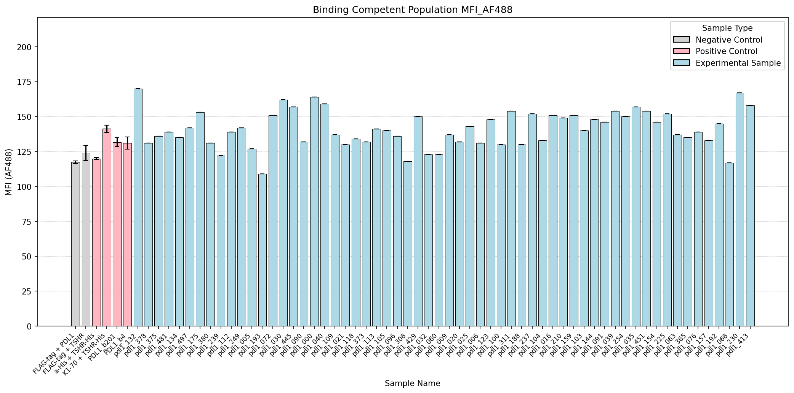

# Flow Cytometry Analysis Summary

## Key Findings

- Experimental samples >2X mock expression: 38 (pdl1_000, pdl1_030, pdl1_072, pdl1_105, pdl1_144, pdl1_311, pdl1_445, pdl1_005, pdl1_032, pdl1_109, pdl1_006, pdl1_090, pdl1_112, pdl1_373, pdl1_481, pdl1_091, pdl1_113, pdl1_159, pdl1_237, pdl1_375, pdl1_497, pdl1_096, pdl1_118, pdl1_175, pdl1_239, pdl1_378, pdl1_020, pdl1_060, pdl1_123, pdl1_188, pdl1_249, pdl1_380, pdl1_021, pdl1_103, pdl1_132, pdl1_134, pdl1_193, pdl1_429)
- From that subset, samples >2X FLAG binding %Parent threshold: 0 (None)
- From that subset, samples above mean AF488/AF647 ratio of all controls (23.90): 0 (None)

## Data Table

| Sample Name        | Sample Type         | >2X Mock Expression   | Expression Level (MFI_AF647)   | Singlets/AF647(+)/AF488(+) %Parent   | MFI Ratio (AF488/AF647)   | MFI AF488      |
|:-------------------|:--------------------|:----------------------|:-------------------------------|:-------------------------------------|:--------------------------|:---------------|
| pdl1_000           | Experimental Sample | Yes                   | 8.38 ± 0.00                    | 0.16 ± 0.00                          | 16.30 ± 0.00              | 164.00 ± 0.00  |
| pdl1_030           | Experimental Sample | Yes                   | 21.10 ± 0.00                   | 0.15 ± 0.00                          | 5.98 ± 0.00               | 162.00 ± 0.00  |
| pdl1_072           | Experimental Sample | Yes                   | 16.10 ± 0.00                   | 0.15 ± 0.00                          | 6.30 ± 0.00               | 151.00 ± 0.00  |
| pdl1_105           | Experimental Sample | Yes                   | 53.40 ± 0.00                   | 0.19 ± 0.00                          | 1.23 ± 0.00               | 140.00 ± 0.00  |
| pdl1_144           | Experimental Sample | Yes                   | 42.90 ± 0.00                   | 0.52 ± 0.00                          | 1.23 ± 0.00               | 148.00 ± 0.00  |
| pdl1_210           | Experimental Sample | No                    | 7.66 ± 0.00                    | 0.37 ± 0.00                          | 13.10 ± 0.00              | 149.00 ± 0.00  |
| pdl1_311           | Experimental Sample | Yes                   | 10.80 ± 0.00                   | 0.31 ± 0.00                          | 12.10 ± 0.00              | 154.00 ± 0.00  |
| pdl1_445           | Experimental Sample | Yes                   | 21.80 ± 0.00                   | 0.15 ± 0.00                          | 2.20 ± 0.00               | 157.00 ± 0.00  |
| pdl1_005           | Experimental Sample | Yes                   | 18.60 ± 0.00                   | 0.15 ± 0.00                          | 2.53 ± 0.00               | 127.00 ± 0.00  |
| pdl1_032           | Experimental Sample | Yes                   | 17.90 ± 0.00                   | 0.22 ± 0.00                          | 1.55 ± 0.00               | 123.00 ± 0.00  |
| pdl1_076           | Experimental Sample | No                    | 3.56 ± 0.00                    | 0.96 ± 0.00                          | 13.20 ± 0.00              | 139.00 ± 0.00  |
| pdl1_109           | Experimental Sample | Yes                   | 44.60 ± 0.00                   | 0.17 ± 0.00                          | 0.91 ± 0.00               | 137.00 ± 0.00  |
| pdl1_154           | Experimental Sample | No                    | 2.67 ± 0.00                    | 0.79 ± 0.00                          | 23.50 ± 0.00              | 146.00 ± 0.00  |
| pdl1_225           | Experimental Sample | No                    | 5.44 ± 0.00                    | 0.81 ± 0.00                          | 9.98 ± 0.00               | 152.00 ± 0.00  |
| pdl1_365           | Experimental Sample | No                    | 2.06 ± 0.00                    | 0.90 ± 0.00                          | 20.10 ± 0.00              | 135.00 ± 0.00  |
| pdl1_451           | Experimental Sample | No                    | 6.47 ± 0.00                    | 0.75 ± 0.00                          | 10.00 ± 0.00              | 154.00 ± 0.00  |
| pdl1_006           | Experimental Sample | Yes                   | 22.10 ± 0.00                   | 0.26 ± 0.00                          | 2.70 ± 0.00               | 131.00 ± 0.00  |
| pdl1_035           | Experimental Sample | No                    | 7.88 ± 0.00                    | 0.72 ± 0.00                          | 18.60 ± 0.00              | 157.00 ± 0.00  |
| pdl1_090           | Experimental Sample | Yes                   | 28.70 ± 0.00                   | 0.16 ± 0.00                          | 1.27 ± 0.00               | 132.00 ± 0.00  |
| pdl1_112           | Experimental Sample | Yes                   | 15.90 ± 0.00                   | 0.15 ± 0.00                          | 4.49 ± 0.00               | 139.00 ± 0.00  |
| pdl1_157           | Experimental Sample | No                    | 2.49 ± 0.00                    | 1.10 ± 0.00                          | 13.30 ± 0.00              | 133.00 ± 0.00  |
| pdl1_230           | Experimental Sample | No                    | 1.83 ± 0.00                    | 2.22 ± 0.00                          | 31.30 ± 0.00              | 167.00 ± 0.00  |
| pdl1_373           | Experimental Sample | Yes                   | 16.70 ± 0.00                   | 0.18 ± 0.00                          | 4.11 ± 0.00               | 132.00 ± 0.00  |
| pdl1_481           | Experimental Sample | Yes                   | 23.00 ± 0.00                   | 0.12 ± 0.00                          | 3.28 ± 0.00               | 139.00 ± 0.00  |
| pdl1_009           | Experimental Sample | No                    | 5.51 ± 0.00                    | 0.23 ± 0.00                          | 19.20 ± 0.00              | 137.00 ± 0.00  |
| pdl1_039           | Experimental Sample | No                    | 7.69 ± 0.00                    | 0.61 ± 0.00                          | 12.20 ± 0.00              | 154.00 ± 0.00  |
| pdl1_091           | Experimental Sample | Yes                   | 20.80 ± 0.00                   | 0.53 ± 0.00                          | 2.26 ± 0.00               | 146.00 ± 0.00  |
| pdl1_113           | Experimental Sample | Yes                   | 28.60 ± 0.00                   | 0.18 ± 0.00                          | 3.81 ± 0.00               | 141.00 ± 0.00  |
| pdl1_159           | Experimental Sample | Yes                   | 15.60 ± 0.00                   | 0.45 ± 0.00                          | 2.38 ± 0.00               | 151.00 ± 0.00  |
| pdl1_237           | Experimental Sample | Yes                   | 22.60 ± 0.00                   | 0.32 ± 0.00                          | 2.72 ± 0.00               | 152.00 ± 0.00  |
| pdl1_375           | Experimental Sample | Yes                   | 42.30 ± 0.00                   | 0.11 ± 0.00                          | 1.90 ± 0.00               | 136.00 ± 0.00  |
| pdl1_497           | Experimental Sample | Yes                   | 19.10 ± 0.00                   | 0.14 ± 0.00                          | 6.12 ± 0.00               | 142.00 ± 0.00  |
| pdl1_016           | Experimental Sample | No                    | 5.99 ± 0.00                    | 0.35 ± 0.00                          | 14.20 ± 0.00              | 151.00 ± 0.00  |
| pdl1_040           | Experimental Sample | No                    | 7.97 ± 0.00                    | 0.17 ± 0.00                          | 12.10 ± 0.00              | 159.00 ± 0.00  |
| pdl1_096           | Experimental Sample | Yes                   | 25.70 ± 0.00                   | 0.19 ± 0.00                          | 2.36 ± 0.00               | 136.00 ± 0.00  |
| pdl1_118           | Experimental Sample | Yes                   | 14.00 ± 0.00                   | 0.18 ± 0.00                          | 11.20 ± 0.00              | 134.00 ± 0.00  |
| pdl1_175           | Experimental Sample | Yes                   | 16.20 ± 0.00                   | 0.14 ± 0.00                          | 4.95 ± 0.00               | 153.00 ± 0.00  |
| pdl1_239           | Experimental Sample | Yes                   | 40.50 ± 0.00                   | 0.15 ± 0.00                          | 2.95 ± 0.00               | 122.00 ± 0.00  |
| pdl1_378           | Experimental Sample | Yes                   | 35.00 ± 0.00                   | 0.11 ± 0.00                          | 2.20 ± 0.00               | 131.00 ± 0.00  |
| pdl1_020           | Experimental Sample | Yes                   | 8.43 ± 0.00                    | 0.23 ± 0.00                          | 7.85 ± 0.00               | 132.00 ± 0.00  |
| pdl1_060           | Experimental Sample | Yes                   | 18.70 ± 0.00                   | 0.22 ± 0.00                          | 2.52 ± 0.00               | 123.00 ± 0.00  |
| pdl1_100           | Experimental Sample | No                    | 8.22 ± 0.00                    | 0.29 ± 0.00                          | 10.90 ± 0.00              | 130.00 ± 0.00  |
| pdl1_123           | Experimental Sample | Yes                   | 9.98 ± 0.00                    | 0.28 ± 0.00                          | 6.28 ± 0.00               | 148.00 ± 0.00  |
| pdl1_188           | Experimental Sample | Yes                   | 19.80 ± 0.00                   | 0.32 ± 0.00                          | 2.75 ± 0.00               | 130.00 ± 0.00  |
| pdl1_249           | Experimental Sample | Yes                   | 28.10 ± 0.00                   | 0.15 ± 0.00                          | 2.18 ± 0.00               | 142.00 ± 0.00  |
| pdl1_380           | Experimental Sample | Yes                   | 30.30 ± 0.00                   | 0.14 ± 0.00                          | 1.49 ± 0.00               | 131.00 ± 0.00  |
| pdl1_021           | Experimental Sample | Yes                   | 40.20 ± 0.00                   | 0.17 ± 0.00                          | 1.71 ± 0.00               | 130.00 ± 0.00  |
| pdl1_063           | Experimental Sample | No                    | 6.28 ± 0.00                    | 0.82 ± 0.00                          | 9.83 ± 0.00               | 137.00 ± 0.00  |
| pdl1_103           | Experimental Sample | Yes                   | 23.30 ± 0.00                   | 0.47 ± 0.00                          | 2.00 ± 0.00               | 140.00 ± 0.00  |
| pdl1_132           | Experimental Sample | Yes                   | 9.26 ± 0.00                    | 0.10 ± 0.00                          | 9.03 ± 0.00               | 170.00 ± 0.00  |
| pdl1_192           | Experimental Sample | No                    | 2.00 ± 0.00                    | 1.21 ± 0.00                          | 14.90 ± 0.00              | 145.00 ± 0.00  |
| pdl1_254           | Experimental Sample | No                    | 4.63 ± 0.00                    | 0.69 ± 0.00                          | 11.30 ± 0.00              | 150.00 ± 0.00  |
| pdl1_413           | Experimental Sample | No                    | 6.14 ± 0.00                    | 2.72 ± 0.00                          | 39.40 ± 0.00              | 158.00 ± 0.00  |
| pdl1_025           | Experimental Sample | No                    | 5.89 ± 0.00                    | 0.26 ± 0.00                          | 14.20 ± 0.00              | 143.00 ± 0.00  |
| pdl1_068           | Experimental Sample | No                    | 2.31 ± 0.00                    | 1.22 ± 0.00                          | 10.40 ± 0.00              | 117.00 ± 0.00  |
| pdl1_104           | Experimental Sample | No                    | 6.72 ± 0.00                    | 0.34 ± 0.00                          | 13.80 ± 0.00              | 133.00 ± 0.00  |
| pdl1_134           | Experimental Sample | Yes                   | 23.90 ± 0.00                   | 0.13 ± 0.00                          | 3.29 ± 0.00               | 135.00 ± 0.00  |
| pdl1_193           | Experimental Sample | Yes                   | 31.80 ± 0.00                   | 0.15 ± 0.00                          | 2.31 ± 0.00               | 109.00 ± 0.00  |
| pdl1_308           | Experimental Sample | No                    | 7.85 ± 0.00                    | 0.20 ± 0.00                          | 15.60 ± 0.00              | 118.00 ± 0.00  |
| pdl1_429           | Experimental Sample | Yes                   | 17.30 ± 0.00                   | 0.20 ± 0.00                          | 4.61 ± 0.00               | 150.00 ± 0.00  |
| FLAG-tag + PDL1    | Negative Control    | No                    | 5.73 ± 0.13                    | 0.31 ± 0.08                          | 21.87 ± 1.53              | 117.33 ± 0.88  |
| FLAG-tag + TSHR    | Negative Control    | No                    | 5.29 ± 0.47                    | 0.34 ± 0.16                          | 24.30 ± 5.62              | 124.00 ± 5.51  |
| a-His + TSHR-His   | Positive Control    | No                    | 5.44 ± 0.21                    | 6.19 ± 0.82                          | 0.68 ± 0.14               | 120.00 ± 0.58  |
| K1-70 + TSHR-His   | Positive Control    | Yes                   | 16.34 ± 7.14                   | 1.06 ± 0.12                          | 0.70 ± 0.61               | 141.33 ± 2.60  |
| PDL1_b4            | Positive Control    | No                    | 5.18 ± 0.28                    | 0.49 ± 0.05                          | 18.50 ± 2.52              | 131.00 ± 4.36  |
| PDL1_b201          | Positive Control    | No                    | 4.68 ± 0.11                    | 0.59 ± 0.14                          | 25.97 ± 4.42              | 131.67 ± 3.18  |
| Mock + FLAG(AF647) | Negative Control    | No                    | 2.35 ± 0.16                    | 0.79 ± 0.23                          | 70.65 ± 3.35              | 98.05 ± 8.95   |
| Mock + His(AF488)  | Negative Control    | No                    | 5.96 ± 0.21                    | 2.96 ± 1.04                          | 28.55 ± 10.15             | 128.50 ± 22.50 |
| Mock Unlabeled     | Negative Control    | No                    | 1.32 ± 0.08                    | 0.00 ± 0.00                          | nan ± nan                 | nan ± nan      |

## Figures

### Binding Competent Population (%Parent)

### Expression Level of Transfected Cells MFI_AF647

### Binding Competent Population Single-Cell Ratio of AF488/AF647

### Binding Competent Population MFI_AF488

