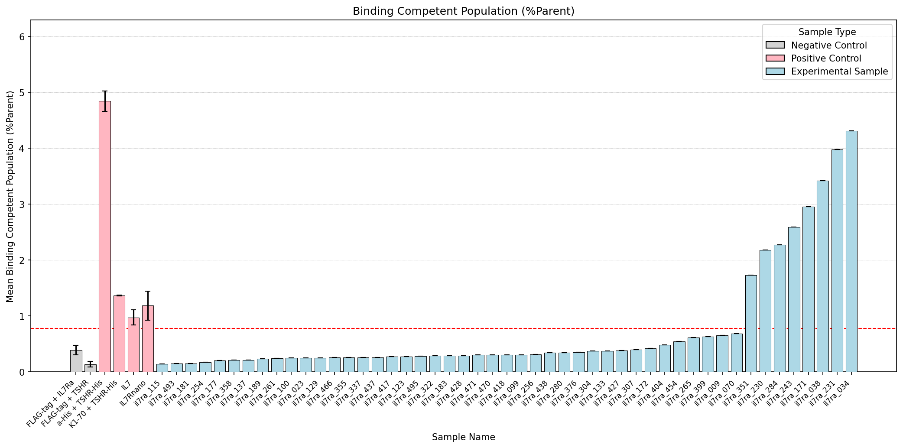
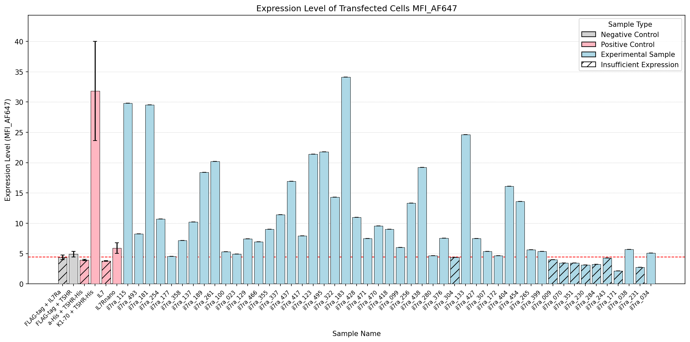
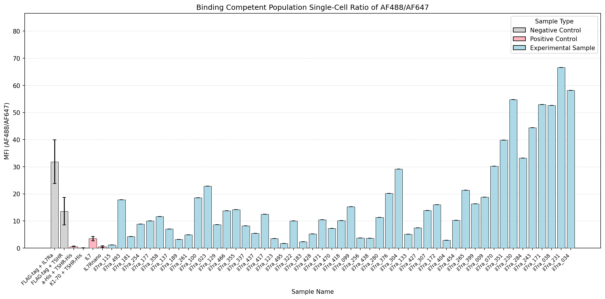
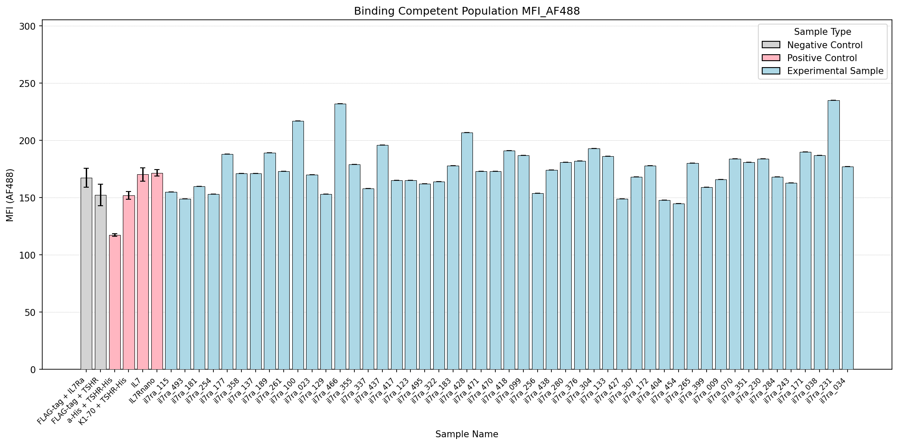

# Flow Cytometry Analysis Summary

## Key Findings

- Experimental samples >2X mock expression: 40 (il7ra_123, il7ra_183, il7ra_265, il7ra_355, il7ra_428, il7ra_495, il7ra_023, il7ra_129, il7ra_189, il7ra_280, il7ra_358, il7ra_437, il7ra_034, il7ra_133, il7ra_376, il7ra_438, il7ra_038, il7ra_137, il7ra_399, il7ra_454, il7ra_307, il7ra_404, il7ra_466, il7ra_099, il7ra_172, il7ra_254, il7ra_322, il7ra_417, il7ra_470, il7ra_100, il7ra_177, il7ra_256, il7ra_337, il7ra_418, il7ra_471, il7ra_115, il7ra_181, il7ra_261, il7ra_427, il7ra_493)
- From that subset, samples >2X FLAG binding %Parent threshold: 2 (il7ra_034, il7ra_038)
- From that subset, samples above mean AF488/AF647 ratio of all controls (10.60): 2 (il7ra_034, il7ra_038)

## Data Table

| Sample Name        | Sample Type         | >2X Mock Expression   | Expression Level (MFI_AF647)   | Singlets/AF647(+)/AF488(+) %Parent   | MFI Ratio (AF488/AF647)   | MFI AF488      |
|:-------------------|:--------------------|:----------------------|:-------------------------------|:-------------------------------------|:--------------------------|:---------------|
| il7ra_009          | Experimental Sample | No                    | 3.97 ± 0.00                    | 0.65 ± 0.00                          | 18.80 ± 0.00              | 166.00 ± 0.00  |
| il7ra_123          | Experimental Sample | Yes                   | 21.40 ± 0.00                   | 0.27 ± 0.00                          | 3.51 ± 0.00               | 165.00 ± 0.00  |
| il7ra_183          | Experimental Sample | Yes                   | 34.10 ± 0.00                   | 0.29 ± 0.00                          | 2.40 ± 0.00               | 178.00 ± 0.00  |
| il7ra_265          | Experimental Sample | Yes                   | 5.64 ± 0.00                    | 0.61 ± 0.00                          | 21.40 ± 0.00              | 180.00 ± 0.00  |
| il7ra_355          | Experimental Sample | Yes                   | 9.03 ± 0.00                    | 0.26 ± 0.00                          | 14.20 ± 0.00              | 179.00 ± 0.00  |
| il7ra_428          | Experimental Sample | Yes                   | 11.00 ± 0.00                   | 0.29 ± 0.00                          | 5.25 ± 0.00               | 207.00 ± 0.00  |
| il7ra_495          | Experimental Sample | Yes                   | 21.80 ± 0.00                   | 0.28 ± 0.00                          | 1.71 ± 0.00               | 162.00 ± 0.00  |
| il7ra_023          | Experimental Sample | Yes                   | 4.91 ± 0.00                    | 0.25 ± 0.00                          | 22.80 ± 0.00              | 170.00 ± 0.00  |
| il7ra_129          | Experimental Sample | Yes                   | 7.45 ± 0.00                    | 0.25 ± 0.00                          | 8.71 ± 0.00               | 153.00 ± 0.00  |
| il7ra_189          | Experimental Sample | Yes                   | 18.40 ± 0.00                   | 0.23 ± 0.00                          | 3.21 ± 0.00               | 189.00 ± 0.00  |
| il7ra_280          | Experimental Sample | Yes                   | 4.67 ± 0.00                    | 0.34 ± 0.00                          | 11.30 ± 0.00              | 181.00 ± 0.00  |
| il7ra_358          | Experimental Sample | Yes                   | 7.17 ± 0.00                    | 0.21 ± 0.00                          | 11.70 ± 0.00              | 171.00 ± 0.00  |
| il7ra_437          | Experimental Sample | Yes                   | 16.90 ± 0.00                   | 0.26 ± 0.00                          | 5.41 ± 0.00               | 196.00 ± 0.00  |
| il7ra_034          | Experimental Sample | Yes                   | 5.09 ± 0.00                    | 4.31 ± 0.00                          | 58.20 ± 0.00              | 177.00 ± 0.00  |
| il7ra_133          | Experimental Sample | Yes                   | 24.60 ± 0.00                   | 0.37 ± 0.00                          | 5.18 ± 0.00               | 186.00 ± 0.00  |
| il7ra_230          | Experimental Sample | No                    | 3.12 ± 0.00                    | 2.18 ± 0.00                          | 54.80 ± 0.00              | 184.00 ± 0.00  |
| il7ra_284          | Experimental Sample | No                    | 3.24 ± 0.00                    | 2.27 ± 0.00                          | 33.20 ± 0.00              | 168.00 ± 0.00  |
| il7ra_376          | Experimental Sample | Yes                   | 7.54 ± 0.00                    | 0.35 ± 0.00                          | 20.20 ± 0.00              | 182.00 ± 0.00  |
| il7ra_438          | Experimental Sample | Yes                   | 19.20 ± 0.00                   | 0.34 ± 0.00                          | 3.69 ± 0.00               | 174.00 ± 0.00  |
| il7ra_038          | Experimental Sample | Yes                   | 5.69 ± 0.00                    | 3.42 ± 0.00                          | 52.60 ± 0.00              | 187.00 ± 0.00  |
| il7ra_137          | Experimental Sample | Yes                   | 10.20 ± 0.00                   | 0.21 ± 0.00                          | 7.04 ± 0.00               | 171.00 ± 0.00  |
| il7ra_231          | Experimental Sample | No                    | 2.72 ± 0.00                    | 3.98 ± 0.00                          | 66.60 ± 0.00              | 235.00 ± 0.00  |
| il7ra_304          | Experimental Sample | No                    | 4.39 ± 0.00                    | 0.37 ± 0.00                          | 29.20 ± 0.00              | 193.00 ± 0.00  |
| il7ra_399          | Experimental Sample | Yes                   | 5.35 ± 0.00                    | 0.63 ± 0.00                          | 16.30 ± 0.00              | 159.00 ± 0.00  |
| il7ra_454          | Experimental Sample | Yes                   | 13.60 ± 0.00                   | 0.54 ± 0.00                          | 10.30 ± 0.00              | 145.00 ± 0.00  |
| il7ra_070          | Experimental Sample | No                    | 3.46 ± 0.00                    | 0.68 ± 0.00                          | 30.20 ± 0.00              | 184.00 ± 0.00  |
| il7ra_171          | Experimental Sample | No                    | 2.11 ± 0.00                    | 2.95 ± 0.00                          | 52.90 ± 0.00              | 190.00 ± 0.00  |
| il7ra_243          | Experimental Sample | No                    | 4.28 ± 0.00                    | 2.59 ± 0.00                          | 44.40 ± 0.00              | 163.00 ± 0.00  |
| il7ra_307          | Experimental Sample | Yes                   | 5.35 ± 0.00                    | 0.40 ± 0.00                          | 13.90 ± 0.00              | 168.00 ± 0.00  |
| il7ra_404          | Experimental Sample | Yes                   | 16.10 ± 0.00                   | 0.48 ± 0.00                          | 2.93 ± 0.00               | 148.00 ± 0.00  |
| il7ra_466          | Experimental Sample | Yes                   | 6.95 ± 0.00                    | 0.26 ± 0.00                          | 13.80 ± 0.00              | 232.00 ± 0.00  |
| il7ra_099          | Experimental Sample | Yes                   | 5.99 ± 0.00                    | 0.30 ± 0.00                          | 15.30 ± 0.00              | 187.00 ± 0.00  |
| il7ra_172          | Experimental Sample | Yes                   | 4.63 ± 0.00                    | 0.42 ± 0.00                          | 16.00 ± 0.00              | 178.00 ± 0.00  |
| il7ra_254          | Experimental Sample | Yes                   | 10.70 ± 0.00                   | 0.17 ± 0.00                          | 8.92 ± 0.00               | 153.00 ± 0.00  |
| il7ra_322          | Experimental Sample | Yes                   | 14.30 ± 0.00                   | 0.29 ± 0.00                          | 10.10 ± 0.00              | 164.00 ± 0.00  |
| il7ra_417          | Experimental Sample | Yes                   | 7.91 ± 0.00                    | 0.27 ± 0.00                          | 12.50 ± 0.00              | 165.00 ± 0.00  |
| il7ra_470          | Experimental Sample | Yes                   | 9.54 ± 0.00                    | 0.30 ± 0.00                          | 7.23 ± 0.00               | 173.00 ± 0.00  |
| il7ra_100          | Experimental Sample | Yes                   | 5.31 ± 0.00                    | 0.25 ± 0.00                          | 18.60 ± 0.00              | 217.00 ± 0.00  |
| il7ra_177          | Experimental Sample | Yes                   | 4.55 ± 0.00                    | 0.20 ± 0.00                          | 10.10 ± 0.00              | 188.00 ± 0.00  |
| il7ra_256          | Experimental Sample | Yes                   | 13.30 ± 0.00                   | 0.31 ± 0.00                          | 3.80 ± 0.00               | 154.00 ± 0.00  |
| il7ra_337          | Experimental Sample | Yes                   | 11.40 ± 0.00                   | 0.26 ± 0.00                          | 8.24 ± 0.00               | 158.00 ± 0.00  |
| il7ra_418          | Experimental Sample | Yes                   | 9.03 ± 0.00                    | 0.30 ± 0.00                          | 10.20 ± 0.00              | 191.00 ± 0.00  |
| il7ra_471          | Experimental Sample | Yes                   | 7.48 ± 0.00                    | 0.30 ± 0.00                          | 10.50 ± 0.00              | 173.00 ± 0.00  |
| il7ra_115          | Experimental Sample | Yes                   | 29.80 ± 0.00                   | 0.14 ± 0.00                          | 1.21 ± 0.00               | 155.00 ± 0.00  |
| il7ra_181          | Experimental Sample | Yes                   | 29.50 ± 0.00                   | 0.15 ± 0.00                          | 4.31 ± 0.00               | 160.00 ± 0.00  |
| il7ra_261          | Experimental Sample | Yes                   | 20.20 ± 0.00                   | 0.24 ± 0.00                          | 4.91 ± 0.00               | 173.00 ± 0.00  |
| il7ra_351          | Experimental Sample | No                    | 3.44 ± 0.00                    | 1.73 ± 0.00                          | 39.80 ± 0.00              | 181.00 ± 0.00  |
| il7ra_427          | Experimental Sample | Yes                   | 7.47 ± 0.00                    | 0.38 ± 0.00                          | 7.52 ± 0.00               | 149.00 ± 0.00  |
| il7ra_493          | Experimental Sample | Yes                   | 8.24 ± 0.00                    | 0.15 ± 0.00                          | 17.80 ± 0.00              | 149.00 ± 0.00  |
| FLAG-tag + IL7Ra   | Negative Control    | No                    | 4.38 ± 0.36                    | 0.39 ± 0.09                          | 31.83 ± 8.07              | 167.33 ± 8.21  |
| FLAG-tag + TSHR    | Negative Control    | Yes                   | 4.92 ± 0.47                    | 0.14 ± 0.05                          | 13.61 ± 5.08              | 152.33 ± 9.53  |
| a-His + TSHR-His   | Positive Control    | No                    | 3.94 ± 0.09                    | 4.84 ± 0.18                          | 0.58 ± 0.17               | 117.33 ± 1.20  |
| K1-70 + TSHR-His   | Positive Control    | Yes                   | 31.83 ± 8.18                   | 1.36 ± 0.01                          | 0.07 ± 0.00               | 152.00 ± 3.51  |
| IL7                | Positive Control    | No                    | 3.77 ± 0.07                    | 0.97 ± 0.14                          | 3.50 ± 0.77               | 170.33 ± 5.84  |
| IL7Rnano           | Positive Control    | Yes                   | 5.92 ± 0.86                    | 1.18 ± 0.26                          | 0.55 ± 0.33               | 171.67 ± 2.73  |
| Mock + FLAG(AF647) | Negative Control    | No                    | 1.83 ± 0.08                    | 0.00 ± 0.00                          | nan ± nan                 | nan ± nan      |
| Mock + His(AF488)  | Negative Control    | No                    | 2.60 ± 0.80                    | 3.83 ± 0.71                          | 24.04 ± 23.75             | 118.00 ± 17.00 |
| Mock Unlabeled     | Negative Control    | No                    | 1.85 ± 0.68                    | 0.00 ± 0.00                          | nan ± nan                 | nan ± nan      |

## Figures

### Binding Competent Population (%Parent)

### Expression Level of Transfected Cells MFI_AF647

### Binding Competent Population Single-Cell Ratio of AF488/AF647

### Binding Competent Population MFI_AF488

