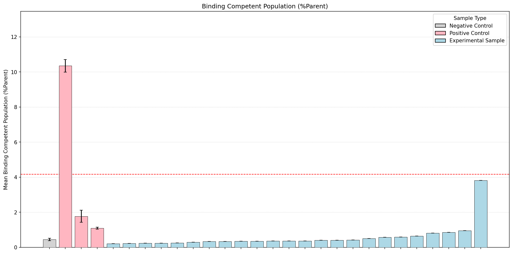
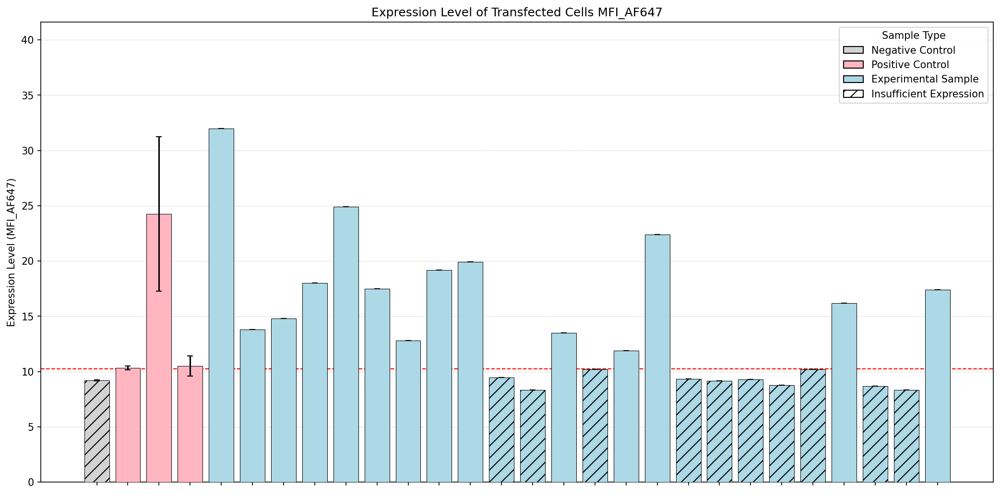
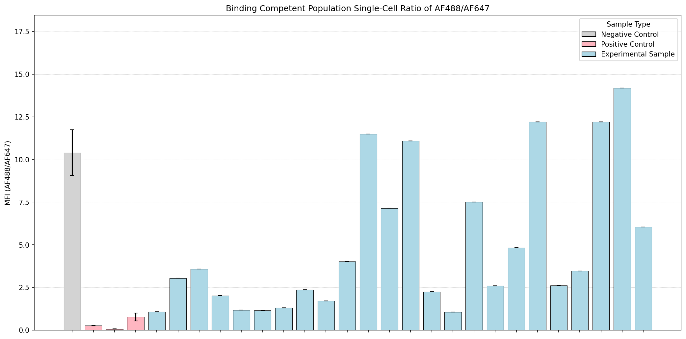
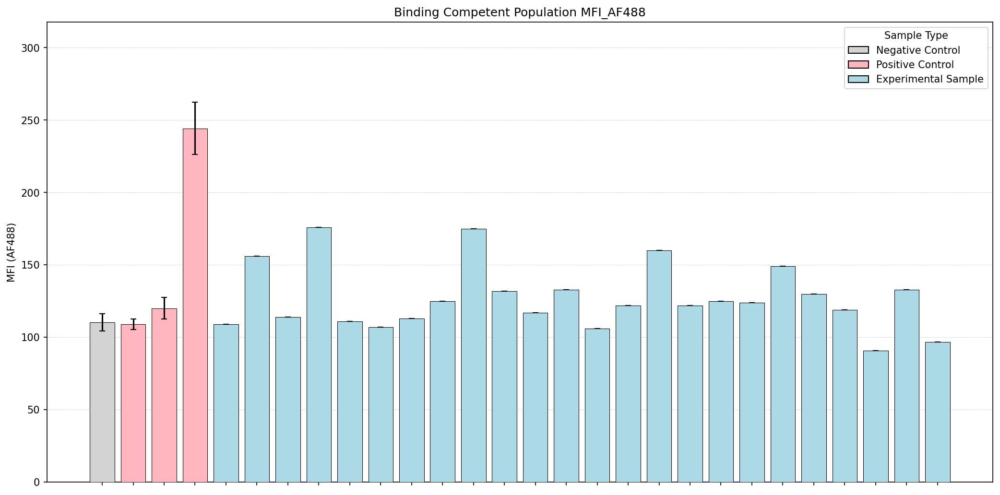

# Flow Cytometry Analysis Summary

## Key Findings

- Experimental samples >2X mock expression: 14 (Anonymous_1, Anonymous_3, Anonymous_5, Anonymous_6, Anonymous_8, Anonymous_9, Anonymous_10, Anonymous_11, Anonymous_13, Anonymous_15, Anonymous_17, Anonymous_18, Anonymous_19, Anonymous_22)
- From that subset, samples >2X FLAG binding %Parent threshold: threshold unavailable (no qualifying FLAG non-mock control found)
- From that subset, samples above mean AF488/AF647 ratio of all controls (5.31): 0 (None)

## Data Table

| Sample Name        | Sample Type         | >2X Mock Expression   | Expression Level (MFI_AF647)   | Singlets/AF647(+)/AF488(+) %Parent   | MFI Ratio (AF488/AF647)   | MFI AF488      |
|:-------------------|:--------------------|:----------------------|:-------------------------------|:-------------------------------------|:--------------------------|:---------------|
| Mock               | Negative Control    | No                    | 6.75 ± 1.95                    | 2.08 ± 2.08                          | 13.40 ± nan               | 77.80 ± nan    |
| Positive Control 1 | Positive Control    | Yes                   | 10.33 ± 0.19                   | 10.35 ± 0.35                         | 0.27 ± 0.01               | 109.00 ± 3.79  |
| Positive Control 2 | Positive Control    | Yes                   | 24.27 ± 6.99                   | 1.77 ± 0.34                          | 0.06 ± 0.01               | 120.00 ± 7.51  |
| Positive Control 3 | Positive Control    | Yes                   | 10.49 ± 0.91                   | 1.09 ± 0.05                          | 0.77 ± 0.22               | 244.33 ± 17.95 |
| Negative Control 1 | Negative Control    | No                    | 9.18 ± 0.05                    | 0.45 ± 0.07                          | 10.41 ± 1.34              | 110.33 ± 5.90  |
| Anonymous_1        | Experimental Sample | Yes                   | 14.80 ± 0.00                   | 0.24 ± 0.00                          | 3.58 ± 0.00               | 114.00 ± 0.00  |
| Anonymous_2        | Experimental Sample | No                    | 8.67 ± 0.00                    | 0.86 ± 0.00                          | 12.20 ± 0.00              | 90.90 ± 0.00   |
| Anonymous_3        | Experimental Sample | Yes                   | 17.40 ± 0.00                   | 3.82 ± 0.00                          | 6.04 ± 0.00               | 96.70 ± 0.00   |
| Anonymous_4        | Experimental Sample | No                    | 9.45 ± 0.00                    | 0.35 ± 0.00                          | 4.03 ± 0.00               | 132.00 ± 0.00  |
| Anonymous_5        | Experimental Sample | Yes                   | 13.50 ± 0.00                   | 0.37 ± 0.00                          | 7.15 ± 0.00               | 133.00 ± 0.00  |
| Anonymous_6        | Experimental Sample | Yes                   | 19.20 ± 0.00                   | 0.33 ± 0.00                          | 2.36 ± 0.00               | 125.00 ± 0.00  |
| Anonymous_7        | Experimental Sample | No                    | 8.77 ± 0.00                    | 0.59 ± 0.00                          | 12.20 ± 0.00              | 149.00 ± 0.00  |
| Anonymous_8        | Experimental Sample | Yes                   | 32.00 ± 0.00                   | 0.21 ± 0.00                          | 1.07 ± 0.00               | 109.00 ± 0.00  |
| Anonymous_9        | Experimental Sample | Yes                   | 18.00 ± 0.00                   | 0.24 ± 0.00                          | 2.03 ± 0.00               | 176.00 ± 0.00  |
| Anonymous_10       | Experimental Sample | Yes                   | 13.80 ± 0.00                   | 0.23 ± 0.00                          | 3.04 ± 0.00               | 156.00 ± 0.00  |
| Anonymous_11       | Experimental Sample | Yes                   | 24.90 ± 0.00                   | 0.25 ± 0.00                          | 1.18 ± 0.00               | 111.00 ± 0.00  |
| Anonymous_12       | Experimental Sample | No                    | 9.34 ± 0.00                    | 0.42 ± 0.00                          | 7.50 ± 0.00               | 122.00 ± 0.00  |
| Anonymous_13       | Experimental Sample | Yes                   | 11.90 ± 0.00                   | 0.40 ± 0.00                          | 2.26 ± 0.00               | 122.00 ± 0.00  |
| Anonymous_14       | Experimental Sample | No                    | 10.20 ± 0.00                   | 0.65 ± 0.00                          | 2.61 ± 0.00               | 130.00 ± 0.00  |
| Anonymous_15       | Experimental Sample | Yes                   | 16.20 ± 0.00                   | 0.81 ± 0.00                          | 3.46 ± 0.00               | 119.00 ± 0.00  |
| Anonymous_16       | Experimental Sample | No                    | 9.29 ± 0.00                    | 0.58 ± 0.00                          | 4.84 ± 0.00               | 124.00 ± 0.00  |
| Anonymous_17       | Experimental Sample | Yes                   | 17.50 ± 0.00                   | 0.29 ± 0.00                          | 1.15 ± 0.00               | 107.00 ± 0.00  |
| Anonymous_18       | Experimental Sample | Yes                   | 12.80 ± 0.00                   | 0.33 ± 0.00                          | 1.30 ± 0.00               | 113.00 ± 0.00  |
| Anonymous_19       | Experimental Sample | Yes                   | 19.90 ± 0.00                   | 0.35 ± 0.00                          | 1.72 ± 0.00               | 175.00 ± 0.00  |
| Anonymous_20       | Experimental Sample | No                    | 10.20 ± 0.00                   | 0.37 ± 0.00                          | 11.10 ± 0.00              | 106.00 ± 0.00  |
| Anonymous_21       | Experimental Sample | No                    | 9.17 ± 0.00                    | 0.50 ± 0.00                          | 2.60 ± 0.00               | 125.00 ± 0.00  |
| Anonymous_22       | Experimental Sample | Yes                   | 22.40 ± 0.00                   | 0.40 ± 0.00                          | 1.05 ± 0.00               | 160.00 ± 0.00  |
| Anonymous_23       | Experimental Sample | No                    | 8.31 ± 0.00                    | 0.95 ± 0.00                          | 14.20 ± 0.00              | 133.00 ± 0.00  |
| Anonymous_24       | Experimental Sample | No                    | 8.31 ± 0.00                    | 0.36 ± 0.00                          | 11.50 ± 0.00              | 117.00 ± 0.00  |
| Mock + His(AF488)  | Negative Control    | No                    | 5.96 ± 3.45                    | 0.28 ± 0.28                          | 6.93 ± nan                | 62.80 ± nan    |
| Mock + FLAG(AF647) | Negative Control    | No                    | 3.42 ± 0.00                    | 0.00 ± 0.00                          | nan ± 0.00                | nan ± 0.00     |
| Mock + Fc(AF488)   | Negative Control    | No                    | 2.64 ± 0.33                    | 0.00 ± 0.00                          | nan ± nan                 | nan ± nan      |

## Figures

### Binding Competent Population (%Parent)

### Expression Level of Transfected Cells MFI_AF647

### Binding Competent Population Single-Cell Ratio of AF488/AF647

### Binding Competent Population MFI_AF488

